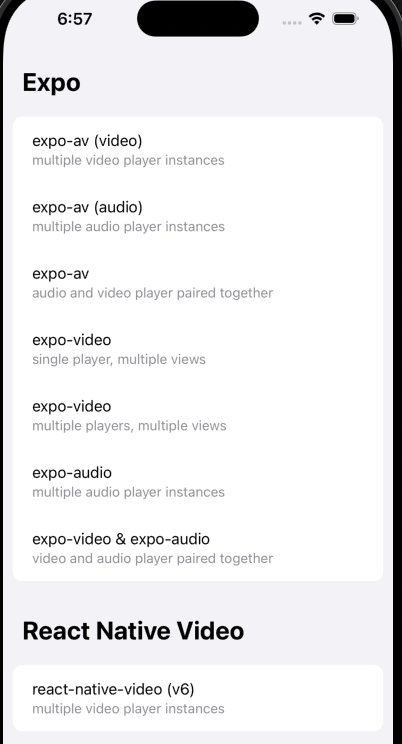
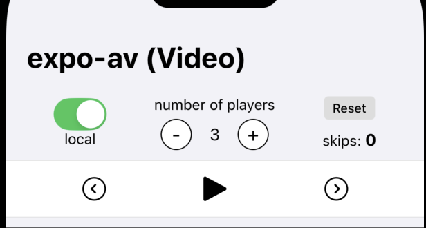

This is a new [**React Native**](https://reactnative.dev) project, bootstrapped using [`@react-native-community/cli`](https://github.com/react-native-community/cli).

# Getting Started

>**Note**: Make sure you have completed the [React Native - Environment Setup](https://reactnative.dev/docs/environment-setup) instructions till "Creating a new application" step, before proceeding.

## Step 1: Start the Metro Server

First, you will need to start **Metro**, the JavaScript _bundler_ that ships _with_ React Native.

To start Metro, run the following command from the _root_ of your React Native project:

```bash
# using npm
npm start

# OR using Yarn
yarn start
```

## Step 2: Start your Application

Let Metro Bundler run in its _own_ terminal. Open a _new_ terminal from the _root_ of your React Native project. Run the following command to start your _Android_ or _iOS_ app:

### For Android

```bash
# using npm
npm run android

# OR using Yarn
yarn android
```

### For iOS

```bash
# using npm
npm run ios

# OR using Yarn
yarn ios
```

If everything is set up _correctly_, you should see your new app running in your _Android Emulator_ or _iOS Simulator_ shortly provided you have set up your emulator/simulator correctly.

This is one way to run your app — you can also run it directly from within Android Studio and Xcode respectively.

# Overview

This app compares **React Native Video**, **Expo-AV** (for both audio and video), and the newer Expo libraries—**expo-video** and **expo-audio**—under stress testing conditions. The main goal is to see how many players and views we can run before hitting performance issues or crashes.

From our findings:

- **Expo-AV** and **react-native-video** package both the player and its view together, making each instance heavier. Running multiple instances often leads to instability or crashes sooner.  
- **expo-video** separates the player from the view, enabling you to manage a single video player across multiple views. This approach shows roughly 5× the capacity in terms of number of views without significant slowdown.  
- However, when **expo-video** is used in a “standalone” manner (where the view and player share the same component), performance under stress resembles that of Expo-AV and React Native Video. 
- For **audio** alone, performance improves further because no view element is involved. Both **expo-av (audio)** and **expo-audio** handle more simultaneous audio players—about 2–3× more than the video combinations—before crashing.  
- Combining audio and video (e.g., **expo-av** with both audio and video in one component) creates additional overhead, resulting in fewer possible instances before a crash.  
- Overall, **expo-video + expo-audio** perform similarly (and slightly better) compared to **expo-av** when combining audio and video.

### Key Takeaway
1. Performance bottlenecks primarily arise when each component holds both the player and its view. Splitting the player from the view greatly improves scalability. 
2. Problems begin to arise when sources are changed, so this seems to indicate and ineffective cleanup or handling of new sources.

> **Disclaimer:**  
> These observations are based on initial, informal tests and should be taken with a grain of salt. However, early indications strongly favor a strategy in which the player and view are decoupled (as in **expo-video**) and where audio and video usage are optimized or split across newer Expo libraries.


## Testing Guide

This app contains several configurations accessible from the main screen. There are two main sections:

1. **Expo**  
2. **React Native Video**  

Each section showcases different approaches using its respective libraries. The titles and subtitles indicate which library is in use (e.g., "`expo-video`") and the configuration type. 

For instance, **"multiple players, multiple views"** means the demo instantiates multiple video players, each paired with its own view. Meanwhile, **"single player, multiple views"** means a single player instance is shared by multiple views. If a library doesn’t support separating the video player from its view, each instance includes both the player and view together.



Within each test configuration, you can:

- Adjust the number of instances  
- Play or pause playback  
- Cycle through various media assets  
- Toggle the asset origin (local or remote)  
- Track how many assets have been skipped while cycling  

